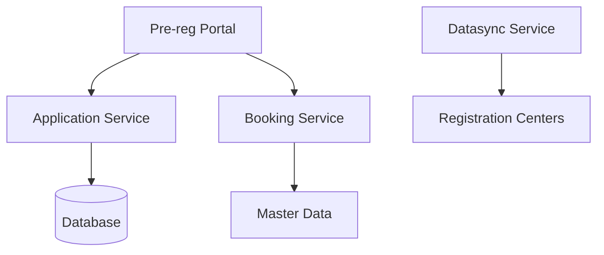

# Proposed Ideal Landing Page Structure (Earlier researched template)

*Based on analysis of top software documentation sites (Stripe, Atlassian, GitHub, AWS, Microsoft, etc.), here's the recommended structure for an enhanced Pre-registration module landing page:*

### **1. Hero Section**
```markdown
# Pre-registration Module
## Streamline identity registration with online pre-enrollment

**Enable residents to complete demographic data entry, document uploads, and appointment booking online before visiting registration centers.**

[Get Started](#quick-start) [View Demo](#demo) [API Reference](api/)

**Key Benefits:** Reduce wait times • Improve data accuracy • 24/7 accessibility • Multi-language support
```

### **2. Quick Start Section**
```markdown
## Quick Start

### For Implementers
```bash
# Deploy Pre-registration module
helm install pre-registration mosip/pre-registration
```
[→ Full deployment guide](deployment-guide.md)

### For Developers
```bash
# Clone and setup development environment
git clone https://github.com/mosip/pre-registration
cd pre-registration && ./setup.sh
```
[→ Developer setup guide](developer-guide.md)

### For End Users
Access the pre-registration portal and complete your application in 3 steps:
1. Enter demographic details → 2. Upload documents → 3. Book appointment
[→ User guide](../test/pre-registration-user-guide.md)
```

### **3. Value Proposition Section**
```markdown
## What Pre-registration Offers

### 🏠 **Convenience**
Complete registration prep from home, reducing center visit time by up to 70%

### 📅 **Smart Scheduling** 
Book appointments at convenient times with real-time availability

### 🌐 **Accessibility**
Multi-language support with both self-service and assisted modes

### 🔒 **Security**
End-to-end encryption with secure document handling and audit trails
```

### **4. How It Works Section**
```markdown
## How It Works


### **For Residents**
1. **Register Online**: Create account and provide demographic information
2. **Upload Documents**: Securely upload required identity documents
3. **Schedule Visit**: Book appointment at convenient registration center
4. **Quick Center Visit**: Present QR code for fast-tracked registration

### **For Registration Centers**
- Pre-filled forms reduce processing time
- Better capacity planning and queue management
- Improved data quality and accuracy
```

### **5. Key Features Highlights**
```markdown
## Key Capabilities

<div class="feature-grid">

### **Multi-language Support**
Interface and data entry in multiple languages with assisted mode for language diversity

### **Document Management**
Upload, preview, and share documents across family members with validation

### **Smart Appointment Booking**
Location-based center discovery with real-time availability and flexible rescheduling

### **QR Code Integration**
Unique QR codes for seamless registration center integration

### **Family Registration**
Register multiple family members with shared documents and group appointments

### **Real-time Notifications**
Email and SMS updates for appointments, reminders, and status changes

</div>

[→ View all features](features.md)
```

### **6. Architecture Overview**
```markdown
## Architecture

Pre-registration consists of 5 microservices integrated with the MOSIP ecosystem:



**Core Services:**
- **Application Service**: Demographics and document management
- **Booking Service**: Appointment scheduling and center management  
- **Datasync Service**: Registration center data synchronization
- **Captcha Service**: Security and bot prevention
- **Batchjob Service**: Background processing and cleanup

[→ Technical architecture details](architecture.md)
```

### **7. Getting Started Paths**
```markdown
## Choose Your Path

<div class="path-cards">

### **🚀 For Implementers**
Deploy and configure Pre-registration for your country
- [Deployment Guide](deployment/)
- [Configuration Guide](configuration.md)
- [Integration Checklist](integration.md)

### **👩‍💻 For Developers**
Extend and customize the module
- [Developer Setup](developer-guide.md)
- [API Documentation](api/)
- [SDK Integration](sdk-guide.md)

### **📋 For Business Analysts**
Understand features and workflows
- [Feature Overview](features.md)
- [User Workflows](workflows.md)
- [Business Requirements](requirements.md)

### **👤 For End Users**
Learn how to use the portal
- [User Guide](../test/pre-registration-user-guide.md)
- [Video Tutorials](tutorials/)
- [FAQ](faq.md)

</div>
```

### **8. Integration and Ecosystem**
```markdown
## MOSIP Ecosystem Integration

Pre-registration seamlessly integrates with:

| Component | Integration | Purpose |
|-----------|-------------|---------|
| **Registration Client** | Datasync API | Pre-filled forms at centers |
| **ID Repository** | Master Data | Dynamic form schemas |
| **Keycloak** | Auth Service | Secure authentication |
| **Notification** | Email/SMS | Appointment notifications |
| **Master Data** | Location API | Registration centers data |

[→ Integration guide](integration.md)
```

### **9. Resources and Support**
```markdown
## Resources

### **📚 Documentation**
- [User Guide](../test/pre-registration-user-guide.md) - End-user instructions
- [API Reference](api/) - Complete API documentation  
- [Configuration](configuration.md) - Setup and customization
- [Troubleshooting](troubleshooting.md) - Common issues and solutions

### **💻 Code and Examples**
- [GitHub Repository](https://github.com/mosip/pre-registration)
- [Sample Implementations](examples/)
- [Integration Examples](integration-examples/)

### **🤝 Community and Support**
- [Community Forum](https://community.mosip.io)
- [Technical Support](mailto:support@mosip.io)
- [Release Notes](releases/)
- [Roadmap](roadmap.md)
```

### **10. Call-to-Action Footer**
```markdown
## Ready to Get Started?

<div class="cta-section">

**For Production Deployment**
[Contact MOSIP Team](mailto:info@mosip.io) for implementation support

**For Development/Testing**
[Quick Setup Guide](quick-start.md) to get running in 15 minutes

**Have Questions?**
[Join Community](https://community.mosip.io) or [Browse FAQ](faq.md)

</div>
```

### **Key Principles Applied:**

1. **Progressive Disclosure**: Start simple, layer in complexity
2. **Multiple Entry Points**: Different paths for different user types
3. **Scannable Content**: Headers, bullet points, visual hierarchy
4. **Action-Oriented**: Clear CTAs and next steps
5. **Social Proof**: Benefits, use cases, ecosystem integration
6. **Visual Elements**: Diagrams, feature grids, cards
7. **Search-Friendly**: Clear headings and structured content
8. **Mobile-Responsive**: Works across devices

*This structure follows patterns from successful documentation sites like Stripe's API docs, GitHub's module pages, and AWS service documentation, adapted for MOSIP's technical audience and use cases.*


-->


<!--

You can create USP or Benefits out of this section below:


### **For Residents**
- **Convenience**: Complete pre-registration from home or any location
- **Time Savings**: Reduced waiting time at registration centers
- **Flexibility**: Schedule appointments at convenient times
- **Transparency**: Real-time status tracking and notifications

### **For Registration Centers**
- **Efficiency**: Pre-filled forms reduce data entry time
- **Capacity Planning**: Better resource allocation and queue management
- **Data Quality**: Improved data accuracy through validation
- **Reduced Workload**: Less manual data entry and verification

### **For Administrators**
- **Resource Optimization**: Better utilization of registration center resources
- **Data Insights**: Comprehensive analytics and reporting
- **Process Automation**: Automated workflows and notifications
- **Scalability**: Flexible system that grows with demand

-->

